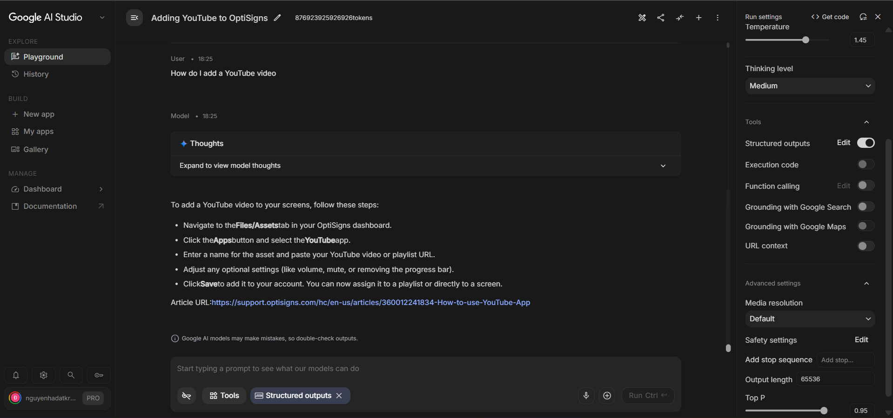

# Project-X-Delta (OptiBot Knowledge Base Sync)

A fully automated pipeline that scrapes knowledge base articles, normalizes them to Markdown, and synchronizes the delta directly to Google Gemini's vector store.

## 1. Setup

1. **Clone the repository:**
   ```bash
   git clone <your-repo-url>
   cd <your-repo-name>
   ```
2. **Install dependencies (Python 3.13):**
   ```bash
   pip install -r requirements.txt
   ```
3. **Configure Environment:**
   ```bash
   cp .env.sample .env
   ```
   Edit `.env` and insert your Gemini API Key: `API_KEY=your_gemini_api_key_here`

## 2. How to run locally

**Using Docker (As requested):**
Build the image with the specific tag `main.py` and execute the container. It will run the scraper, detect deltas, upload new/updated files to the API, log the counts, and exit `0`.

```bash
docker build -t main.py .
docker run -e API_KEY="your_api_key_here" main.py
```

*Note: For persistent local cache during multiple tests, use volume mounts:*
```bash
docker run --rm -v "${PWD}/cache:/app/cache" -v "${PWD}/docs:/app/docs" -v "${PWD}/metadata:/app/metadata" -e API_KEY="your_api_key_here" main.py
```

## 3. Chunking Strategy

To ensure high-quality RAG (Retrieval-Augmented Generation), this project uses a **Semantic Markdown Chunker** (`uploader.py`) instead of naive word-count splitting:
- **Paragraph-Aware Splitting:** Documents are split using double newlines (`\n\n`) to preserve the structural integrity of paragraphs, lists, and tables.
- **Size Threshold (800 words):** A chunk is only split if it exceeds 800 words (~1000 tokens), which is optimal for LLM context windows. Short articles remain intact as a single chunk.
- **Header Context Injection & Overlap:** When a split is necessary, the chunker prepends the most recently observed Markdown header (e.g., `[## Feature X]`) to the newly formed chunk and includes a 100-word overlap. This guarantees that the LLM never loses the semantic context of a section, even if it is fragmented across chunks.

## 4. Daily Job Logs

The daily job is deployed via **GitHub Actions** (Cron at 00:00 UTC). It automatically commits delta state changes back to the repository.

**Link to Daily Job Logs:** [https://github.com/datkrb/AIBotJuly5th/actions](https://github.com/datkrb/AIBotJuly5th/actions)

## 5. Assistant Screenshot

*Below is a screenshot from Google AI Studio (Playground) showing the assistant correctly answering a sample question using the programmatically uploaded files.*


